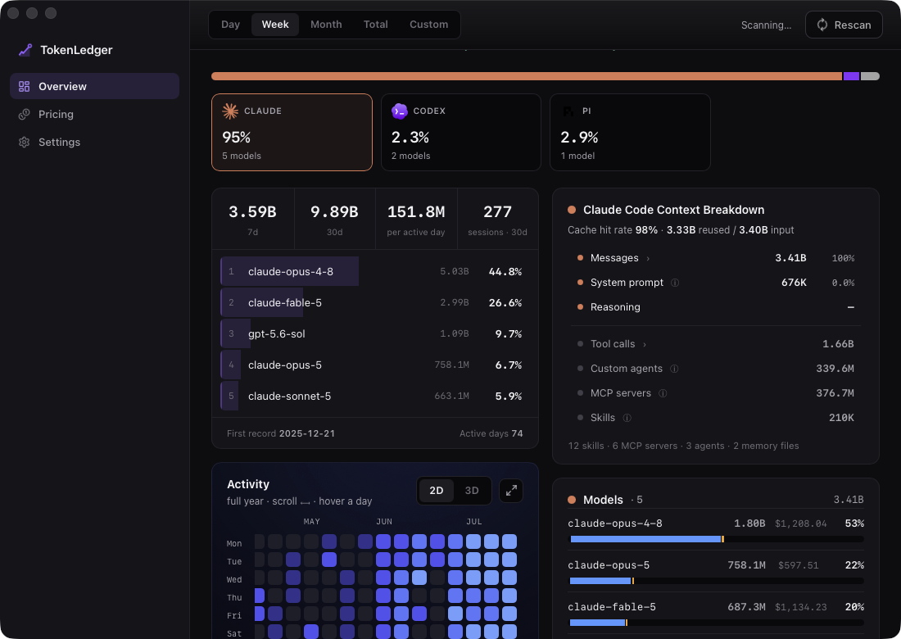

# TokenLedger

A desktop app (Tauri v2) for macOS, Windows, and Linux that tracks token usage
and estimated cost across the AI coding agents and assistants on your machine —
**Claude Code**, **Codex CLI**, **Gemini CLI**, **Hermes**, **Grok Build**,
**Google Antigravity**, and **pi** — by parsing each tool's local logs into a
normalized SQLite ledger.

**Status: 0.1.0.** Driven daily on macOS. Windows and Linux build and pass the
full test suite in CI on every push, but have had no real-world use yet — expect
rough edges there, and please report them.



## What it does

- **Zero-effort tracking** — reads local logs automatically, no manual entry
  and no API keys. Scans on launch and on a configurable timer (off / 30s /
  60s, default 30s).
- **Per-request token detail** — input, output, cache write (5m / 1h TTL
  split), and cache read, normalized so the four categories are mutually
  exclusive across every source.
- **Where the context went** — not just how many tokens, but what they were:
  messages, system prompt, and reasoning, with tool calls, subagents, MCP
  servers, and skills broken out beneath them, down to which tools and which
  Bash commands. Reported for Claude Code, Codex, and pi; the sub-figures are
  size estimates, labeled as such, while the headline splits are exact.
- **Estimated cost** from public API list prices (LiteLLM's pricing
  database), with a bundled offline snapshot and user-editable per-model
  price overrides for self-hosted models (entered as `$ / 1M tokens`).
- **Durable history** — the SQLite database is a permanent ledger. It
  outlives the source logs (Claude Code prunes transcripts after ~30 days by
  default), so once ingested, history is retained even after the originals
  are gone.
- **Always at hand** — a Menu Bar Extra carries today's tokens and cost beside
  its icon, and the panel behind it reads out a window you pick (today,
  yesterday, or the trailing 30 days). Closing the window leaves TokenLedger
  running so it keeps capturing.

Cost is labeled *at API list prices — not billed*: every source here is
subscription, free-tier, or self-hosted, so the number is an estimate, not
an invoice.

## In the app

| Tab | What's on it |
|---|---|
| **Overview** | Everything above, over a date window and source selection you choose — plus **Trend** (enlarges into its own window, bucket size, and per-bucket CSV export), **Activity** (a 12-month heatmap that enlarges into a rotatable 3D landscape), and **Profile** (a portrait of the whole ledger). Activity and Profile deliberately ignore the date window and source selection. |
| **Pricing** | Every model seen in the ledger with its resolved list price, the catalog it came from, and any override you've set |
| **Settings** | Theme (system / light / dark), language (English / 繁體中文), display currency at a fixed exchange rate, launch at login, auto-update checks, and the scan interval |

## Install

Grab the build for your platform from
[Releases](https://github.com/BrianWong05/TokenLedger/releases/latest). Whichever
one you take, it updates itself from then on.

| Platform | Download | Before it runs |
|---|---|---|
| macOS (Apple Silicon) | `.dmg` | Not notarized yet: Gatekeeper says the app "is damaged and can't be opened" → **right-click the app → Open → Open** |
| Windows | `-setup.exe` | Not code-signed yet: SmartScreen says "Windows protected your PC" → **More info → Run anyway** |
| Linux | `.AppImage` | `chmod +x`, and the system tray needs `libayatana-appindicator3-1` (plus the AppIndicator extension on stock GNOME) |

Two things worth knowing before you install:

- **WSL is not scanned.** The Windows build reads the logs under your Windows
  home. Coding tools run inside WSL write to the Linux home instead, so a
  WSL-only setup shows an empty ledger.
- **The Menu Bar Extra is how you get back to the app.** Closing the window
  leaves TokenLedger running so it keeps capturing; on a Linux desktop with no
  system tray at all, that resident presence has nowhere to live.

## Privacy

TokenLedger reads your prompts, the models' responses, thinking, images, tool
arguments, and tool-result bodies — it has to, because sizing them is how the
context breakdown works. **None of that content is written to the database.** It
is measured and discarded.

What the database does hold:

- token counts, request counts, and byte-derived size estimates
- model names, session identifiers, and dates
- absolute paths you already know: the working directory a request came from,
  and the log file it was read out of
- the *names* of tools, MCP servers, skills, and subagents invoked
- for Claude Code's Bash drill-down only, a two-word command signature — the
  executable plus its first non-flag argument. `git commit`, `npm install`, and
  yes, `cat ~/clients/acme/prod.env`. That second word is a real exposure and it
  is deliberate; see
  [ADR-0011](docs/adr/0011-the-ledger-persists-names-never-content.md) for the
  trade-off and its bounds.

Nothing about you leaves the machine. The app makes exactly three outbound
requests, all of them fetches of public data: LiteLLM's price list and
OpenRouter's model list for pricing, and the GitHub release manifest for
updates.

## Data sources

| Tool | What it is | Logs read |
|---|---|---|
| [Claude Code](https://claude.com/claude-code) | Anthropic's CLI coding agent | `~/.claude/projects/**/*.jsonl` |
| [Codex CLI](https://github.com/openai/codex) | OpenAI's CLI coding agent | `~/.codex/sessions/**/rollout-*.jsonl` |
| [Gemini CLI](https://github.com/google-gemini/gemini-cli) | Google's CLI coding agent | `~/.gemini/tmp/*/chats/session-*.json` |
| [Hermes](https://github.com/NousResearch/hermes-agent) | Nous Research's self-improving agent | `~/.hermes/state.db` (opened read-only) |
| [Grok Build](https://github.com/xai-org/grok-build) | Coding agent harness and TUI | `~/.grok/sessions/**/updates.jsonl` |
| [Google Antigravity](https://antigravity.google) | Google's agentic development platform | `~/.gemini/antigravity{,-cli}/conversations/*.db` |
| [pi](https://github.com/earendil-works/pi) | Agent toolkit — unified LLM API, agent loop, TUI, coding agent CLI | `~/.pi/agent/sessions/**/*.jsonl` |

Every path above is under your home directory and is read the same way on all
three platforms. The database lives at `<app data dir>/tokenledger.db` in WAL
mode — `~/Library/Application Support/com.brianwong.tokenledger/` on macOS,
`%APPDATA%\com.brianwong.tokenledger\` on Windows,
`~/.local/share/com.brianwong.tokenledger/` on Linux.

## Where the numbers bend

Every source logs what it wants to, not what a ledger would like. Four of them
distort something in a way worth knowing before you trust a figure.

- **Grok Build's cost is not trustworthy.** Its logs carry a single running
  token counter with no input/output/cache split, so every delta is booked as
  input. Grok can therefore never contribute to the cache hit rate, and its
  cost is computed at input rates for tokens that were really a mix. The token
  total is sound; the money figure beside it is not.
- **Hermes lands on the day a session started.** It stores usage per session
  rather than per call, timestamped at the session's start — so a session opened
  Monday and worked through Wednesday books all of its tokens on Monday. That
  bends Trend and Activity, not just the totals.
- **Google Antigravity counts as one source.** Its IDE and CLI keep separate
  conversation databases; both are read and reported under a single Antigravity
  source rather than split.
- **Claude Code rolls worktrees up.** A git worktree is attributed to its parent
  repository rather than appearing as a project of its own.

Everything else is exact, or says so when it isn't: a source that cannot
attribute a figure shows "—", never a zero standing in for an unknown.

## pi

pi sessions are read from `~/.pi/agent/sessions` and, when those environment
variables are visible to TokenLedger, from `PI_CODING_AGENT_SESSION_DIR` and
`<PI_CODING_AGENT_DIR>/sessions` as well (equivalent roots are de-duplicated).
A missing pi installation is simply an empty source, not an error.

A pi session is a **tree**, not a flat transcript, and TokenLedger honors its
shape:

- **Every branch counts.** Usage on abandoned branches is real usage and stays
  in the ledger; each request's context is attributed along its *own* ancestor
  path, so a sibling branch never leaks into it.
- **Compaction and summaries** are counted. A built-in compaction is one
  request that inherits the branch's active model; afterwards, descendants see
  the summary and retained tail in place of the superseded prefix.
  Pre-compaction history is kept permanently.
- **Forks and clones don't double-count.** Copied history is deduplicated and
  keeps its original project and session; only genuinely new work in the child
  is attributed to the child.
- **Unattributed usage.** pi reports usage on tool results and
  extension-provided summaries with no trustworthy model. Those tokens are
  counted but carry no model: they show as an "Unattributed usage" row, are
  excluded from Pricing, and make a mixed cost *partial* (or *unavailable* when
  a selection is entirely unattributed) — never `$0`. Each such block counts as
  one request, which is a **lower bound** when a block aggregates several hidden
  calls pi does not separate.
- **No system-prompt figure.** pi's logs never reveal it, so it is left unknown
  rather than estimated — the one context category TokenLedger declines to guess
  at for this source.

pi's own token totals should match TokenLedger's for the same discovered
sessions (see the parity check below), while **cost may intentionally differ**:
TokenLedger ignores pi's logged cost and reprices everything through its own
override and list-price rules.

## Development

### Requirements

- macOS (Apple Silicon), Windows, or Linux
- [Rust](https://rustup.rs/) (stable, 2021 edition)
- Node.js 18+ and npm
- Tauri v2 prerequisites — Xcode Command Line Tools on macOS, the MSVC build
  tools on Windows, and on Debian/Ubuntu:
  `libwebkit2gtk-4.1-dev libayatana-appindicator3-dev librsvg2-dev libxdo-dev libssl-dev patchelf`

### Build & run

```bash
# install frontend deps
npm install

# run in development (hot-reload frontend + Rust core)
npm run tauri dev

# build a release bundle for the current platform
npm run tauri build
```

### Tests

```bash
# Rust core: unit + adapter tests
cargo test --manifest-path src-tauri/Cargo.toml

# Frontend tests (components + date-range/formatting logic)
npm test

# Type-check + production frontend build
npm run build
```

### Verifying Claude totals

TokenLedger and [`ccusage`](https://github.com/ryoppippi/ccusage) both read
Claude Code's transcripts and bucket in local time, so their token totals
should match closely:

```bash
npx ccusage@latest --json
```

Token categories line up; **cost will differ** — ccusage uses flat cache
pricing while TokenLedger prices 5-minute and 1-hour cache writes
separately.

### Verifying pi totals

An opt-in test independently sums the canonical token categories over your real
pi sessions — deduplicating copied fork/clone history exactly as the ledger
does — and asserts the ledger's pi totals match. It reads local session data,
so it is `#[ignore]`d and never runs by default (no session content is
committed):

```bash
cargo test --manifest-path src-tauri/Cargo.toml pi_real_log_parity -- --ignored --nocapture
```

Token totals should match; cost may differ, because TokenLedger reprices
everything through its own override and list-price rules rather than trusting
pi's logged cost.

## Contributing

The domain vocabulary lives in [CONTEXT.md](CONTEXT.md) and the decisions
behind the surprising parts live in [docs/adr/](docs/adr/). Both are worth a
read before changing behavior — several things that look like bugs are
load-bearing.

## License

[MIT](LICENSE)
